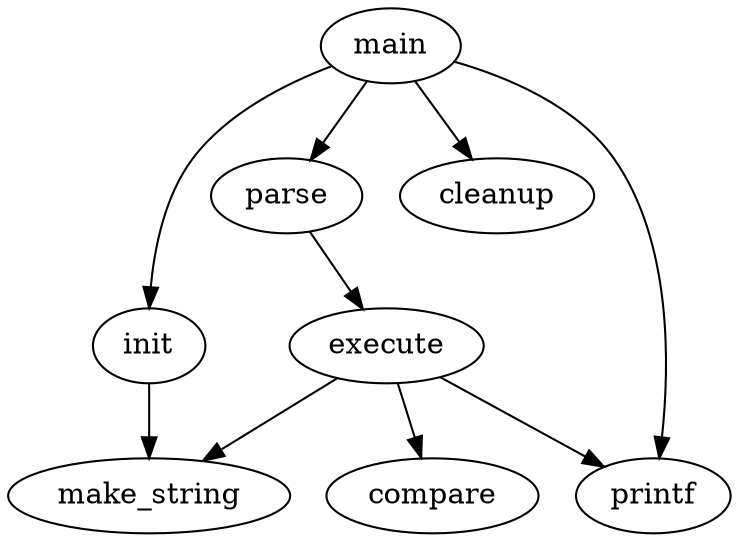

# Code Element

This features provides a convinient way to map a fenced code region to a custom MDX element.

```dot
 digraph G {
    main -> parse -> execute;
    main -> init;
    main -> cleanup;
    execute -> make_string;
    execute -> printf
    init -> make_string;
    main -> printf;
    execute -> compare;
}
```
