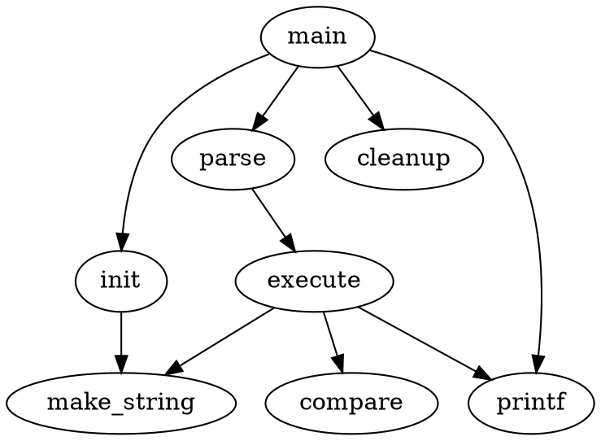

import BrowserWindow from "@site/src/theme/BrowserWindow";

# Code Element

This features provides a convinient way to map a fenced code region to a custom MDX element.
In this example, we map `dot` to a custom graph layout rendering element `Dot`.

```tsx title="./src/theme/Dot/index.tsx"
import React from "react";

export default function Dot(props: {
    // 'dot'
    lang: string;
    // pre-parsed meta string
    meta: object;
    // text in code region
    value: string;
}) {
    return <div>...</div>;
}
```

So that this code section gets replaced with the MDX code using `Dot`.

````markdown

````

<BrowserWindow>


</BrowserWindow>

## Configuration

Add a `codeElement` section in the rise4fun config and map the `lang` identifier to the theme MDX element name.

```js title="./docusaurus.config.js"
const config = configure({ ... }, {
    ...
    // highlight-start
    codeElement: {
        langs: [
            {
                lang: "dot",
                element: "Dot"
            }
        ]
    },
    // highlight-end
})
```
