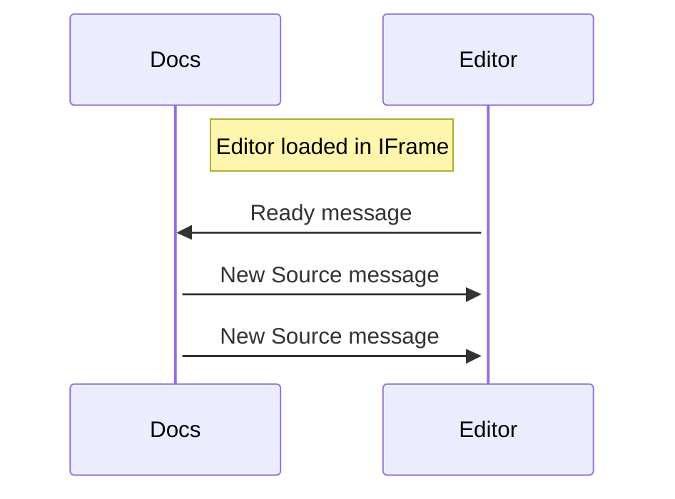

import BrowserWindow from "@theme/BrowserWindow";
import SideEditorButton from "@theme/SideEditorButton";

# Side Editor

This theme adds a collapsible code editor pane 
which can be populated with the code snippets 
from the page.

## Usage

```jsx
import SideEditorButton from "@theme/SideEditorButton";
```

```jsx
<SideEditorButton editorId="devicescript" text={`console.log("hello")`} />
```

<BrowserWindow>
    <SideEditorButton editorId="devicescript" text={`console.log("hello")`} />
</BrowserWindow>

## Configure IFrame editor

You can configure the theme to load an external editor is designed to be hosted as an iframe.

The plugin communicates with the IFrame using [messages](https://developer.mozilla.org/en-US/docs/Web/API/Window/postMessage)
and you will also need to configure their format.



```js title="./docusaurus.config.js"
themeConfig: {
    ...
    sideEditor: {
        editors: [
            {
                type: "iframe",
                id: "devicescript",
                // specify different urls for color modes
                lightUrl: "https://...",
                darkUrl: "https://...",
                // docs -> editor message template
                message: {
                    channel: "devicescript",
                    type: "source",
                    force: true,
                    startMissingSimulators: true,
                },
                messageTextFieldName: "source",
                // editor -> docs ready message
                readyMessage: {
                    channel: "jacdac",
                },
            },
        ],
    },
}
```
