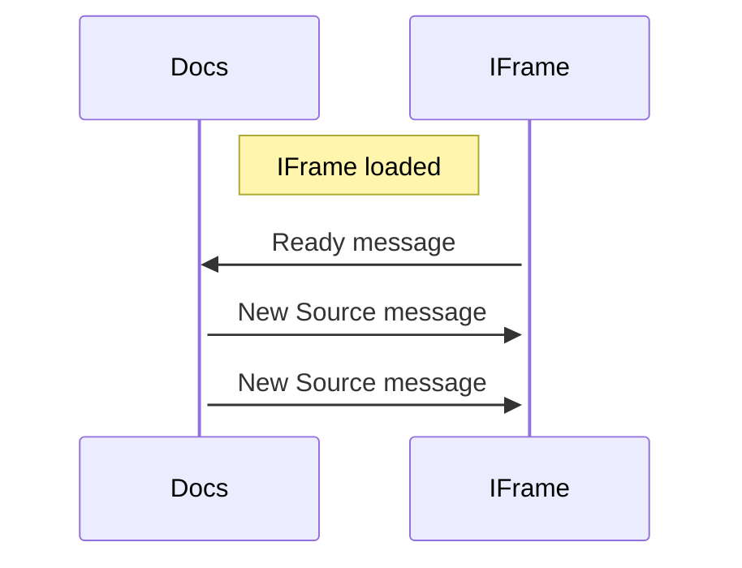

import BrowserWindow from "@theme/BrowserWindow";
import SideEditorButton from "@theme/SideEditorButton";

# Side Editor

This theme adds a collapsible code editor pane
which can be populated with the code snippets
from the page.

The button is hidden in mobile.

## Usage

Add the **edit** meta to a code snippet to inject a `Edit` button that loads the source in the side editor.

````markdown
```msagl edit
graph G {
    kspacey -- swilliams;
    swilliams -- kbacon;
    bpitt -- kbacon;
    hford -- lwilson;
    lwilson -- kbacon;
}
```
````

<BrowserWindow>

```msagl edit
graph G {
    kspacey -- swilliams;
    swilliams -- kbacon;
    bpitt -- kbacon;
    hford -- lwilson;
    lwilson -- kbacon;
}
```

</BrowserWindow>

## Configuration

### IFrame runner

You can configure the theme to load an external iframe. This is the recommended way to integrate your tool

The plugin communicates with the IFrame using [messages](https://developer.mozilla.org/en-US/docs/Web/API/Window/postMessage)
and you will also need to configure their format.



```js title="./docusaurus.config.js"
const config = configure({ ... }, {
    ...
    // highlight-start
    sideEditor: {
        editors: [
            {
                type: "iframe",
                id: "devicescript",
                // specify different urls for color modes
                lightUrl: "https://...",
                darkUrl: "https://...",
                // docs -> editor message template
                message: {
                    channel: "devicescript",
                    type: "source",
                    force: true,
                    startMissingSimulators: true,
                },
                messageTextFieldName: "source",
                // editor -> docs ready message
                readyMessage: {
                    channel: "jacdac",
                },
            },
        ],
    },
    // highlight-end
})
```

### Static IFrame

It's also possible to deploy your tool HTML along with Docusaurus by placing the sources in the `./static/editors` folder.
For example, the `msagljs` tool is wrapped as `./static/editors/msagl.html`.

```html title="./static/editors/msagl.html"
<html>
    <script src="https://unpkg.com/msagl-js@latest/dist.min.js"></script>
    <script src="https://unpkg.com/@msagl/parser@latest/dist.min.js"></script>
    <script src="https://unpkg.com/@msagl/renderer@latest/dist.min.js"></script>
    <body>
        <script type="module">
            const renderer = new msagl.Renderer();
            // handle rendering of dot sources
            window.addEventListener("message", (ev) => {
                const { type, dot } = ev.data
                if (type === 'msagl') {
                    const graph = msagl.parseDot(dot);
                    renderer.setGraph(graph);
                }
            })
            // tell parent, we're ready
            if (window.parent && window.parent !== window)
                window.parent.postMessage({
                    type: 'msagl',
                    state: 'ready'
                })
        </script>
    </body>
</html>
```

```js title="./docusaurus.config.js"
const config = configure({ ... }, {
    ...
    sideEditor: {
        editors: [
            // highlight-start
            {
                id: "msagl",
                lightUrl: "./editors/msagl.html?theme=light",
                darkUrl: "./editors/msagl.html?theme=dark",
                ...
            },
            // highlight-end
            ...
        ]
    }
})
```

### Monaco editor

You can specify the [monaco editor language](https://microsoft.github.io/monaco-editor/)
to enable the Monaco editor.

```js title="./docusaurus.config.js"
const config = configure({ ... }, {
    ...
    sideEditor: {
        editors: [
            {
                id: "devicescript",
                // highlight-next-line
                language: "typescript"
            }
        ]
    }
})
```

### Lang to editor mapping

You can provide a mapping from code language code to editor id.

```js title="./docusaurus.config.js"
const config = configure({ ... }, {
    ...
    sideEditor: {
        // highlight-start
        languages: {
            "ds": "devicescript"
        },
        // highlight-end
        editors: [
            {
                id: "devicescript",
                ...
            }
        ]
    }
})
```

### Panels position persitence

Provide the `persistenceId` field to serialize the tabs positions accross page reloads.

```js title="./docusaurus.config.js"
const config = configure({ ... }, {
    ...
    sideEditor: {
        editors: [
            {
                id: "devicescript",
                // highlight-next-line
                persistenceId: "devicescript"
            }
        ]
    }
})
```
