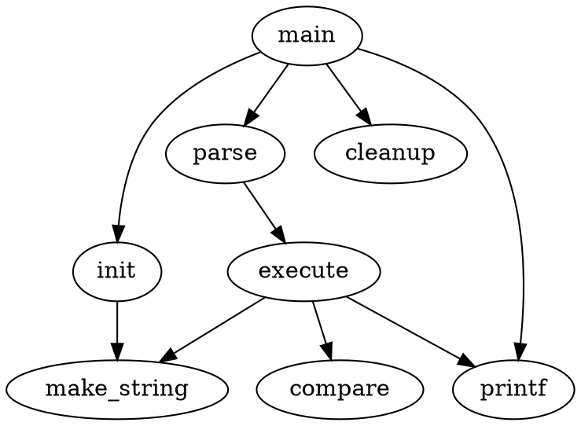

import BrowserWindow from "@site/src/theme/BrowserWindow";

# Remark plugin code element

Docusaurus remark pluging to replace fenced code section with themed MDX markdown.
For example, replace `dot` code to `Dot` JSX.

````markdown

````

<BrowserWindow>


</BrowserWindow>

## Usage

Read the [Code Element documentation](/docs/markdown-features/code-element).

## Configuration

Install the plugin

```bash npm2yarn
npm install @rise4fun/docusaurus-remark-code-element
```

and add to your `docusaurus.configuration.js` file as other remark plugins.

```js
const config = {
    plugins: [
        ...,
        // highlight-start
        ["@rise4fun/docusaurus-remark-code-element", {
            langs: [{
                lang: 'dot',
                element: 'Dot'
            }]
        }]
        // highlight-end
    ]
}
```
